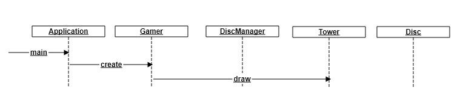
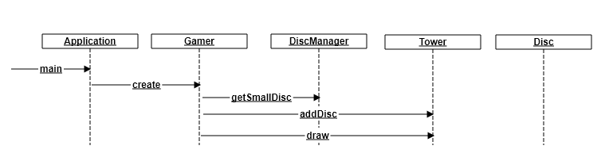
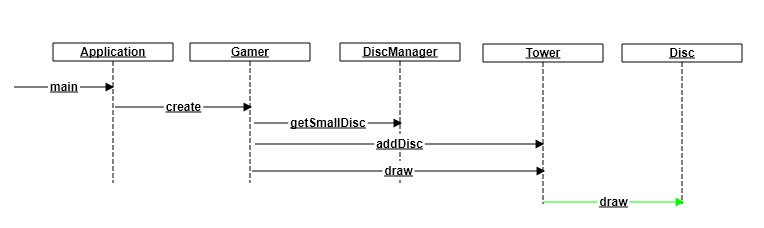
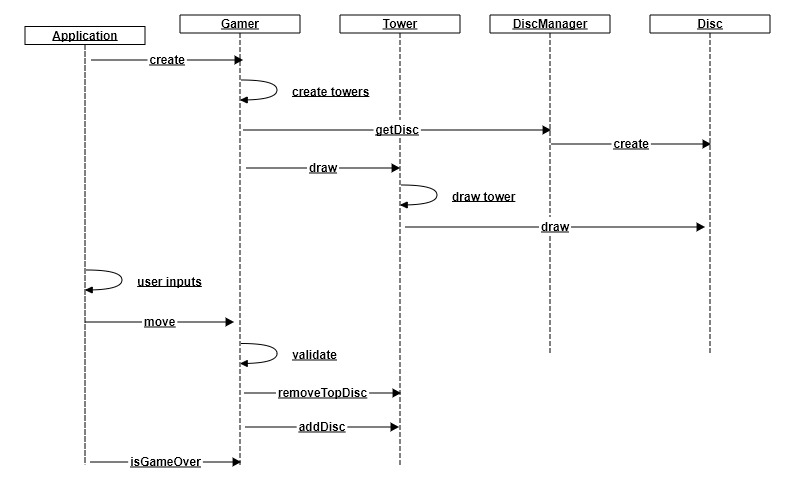
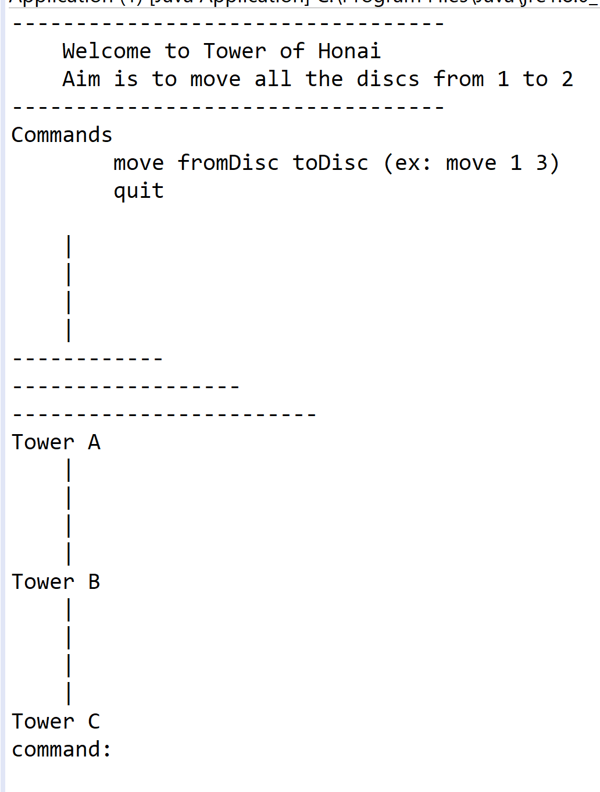
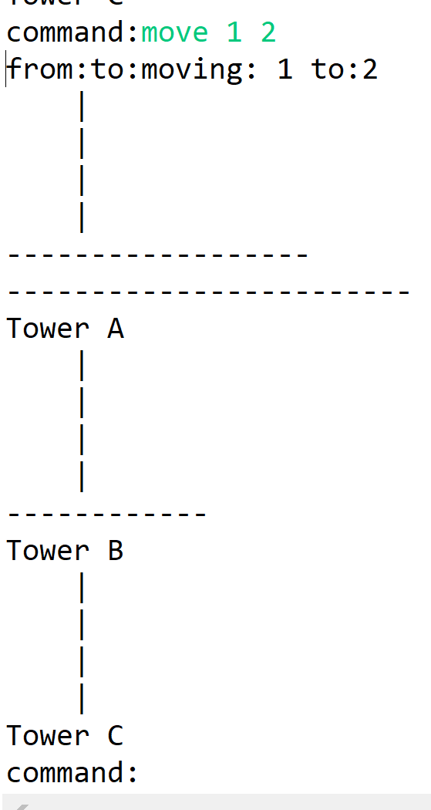
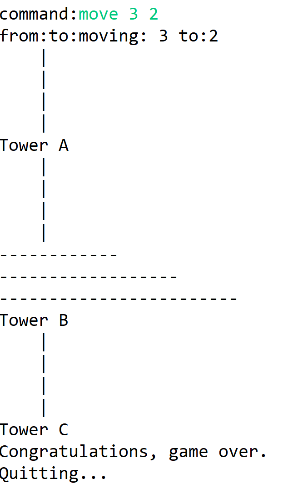

This multi step Java projects is to demonstrate __Tower of Hanoi__ application. We will do first  a console version and next move to GUI application

Follow the steps. 
* Create projects in the same order and same way done in below steps to your Steps project. 
* Run the project and see the results
* Understand each class and its relevance in the project

## Classes
* Application
    * Responsibilities
        * Main class
        * User interaction
    * Collaborations
        * Gamer
* Gamer
    * Responsibilities
        * Manages the game
        * Interacts with tower on behalf of user interaction.
    * Collaborations
        * DiscManager
        * Disc
        * Tower
* Tower
    * Responsibilities
        * Draw the Tower
        * Draws the disc
        * Can tell whether a given disc can be added or not
        * Removes top disc
        * Adds disc
        * Validates dics movement.
    * Collaborations
        * Disc
* Disc
    * Disc drawing functionality
    * Collaborations
        * Disc
* DiscManager ( we will rename this as DiscFactory in later)
    * Responsibilities
        * Creates the discs. 
    * Collaborations
        * Disc

## Sequence Diagrams
### Step2

###  Step3

###  Step4

###  Step9

## Step1
* Basic project and creating relevant classes with dummy methods

## Step2
* Add some bastic methods in each class

## Step3
* Fill __Gamer__ __create__ method with creating a __Tower__ object and using __draw__ method.

## Step4
* Tower will have one disc and uses __draw__ method

## Step5
* Disc __draw__ method is done by drawing simple lines which represents a disc

## Step6
* __DiscManager__ methods were done by creating different discs

## Step7
* __Disc__ has been done properly with constructor taking size and finishing __draw__ method properly.

## Step8
* __Tower__ class has been done with different methods. __draw__ method is done by drawing vertical lines.
* __Gamer__ has done to create 3 towers
* __Application__ class has been done with user interation for moving the disc
* No validations are done here.

## Step9
* __Validations__ has been done added here
* __GameOver__ method has been added.

# Running the program.
When you run final program you should see the below screens

When alln Discs are moved to Tower
